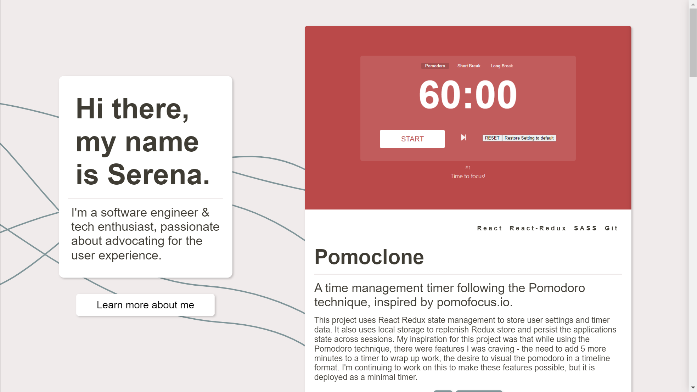
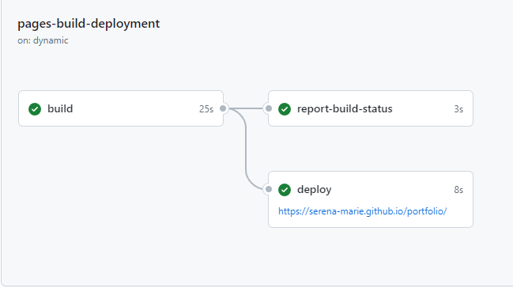
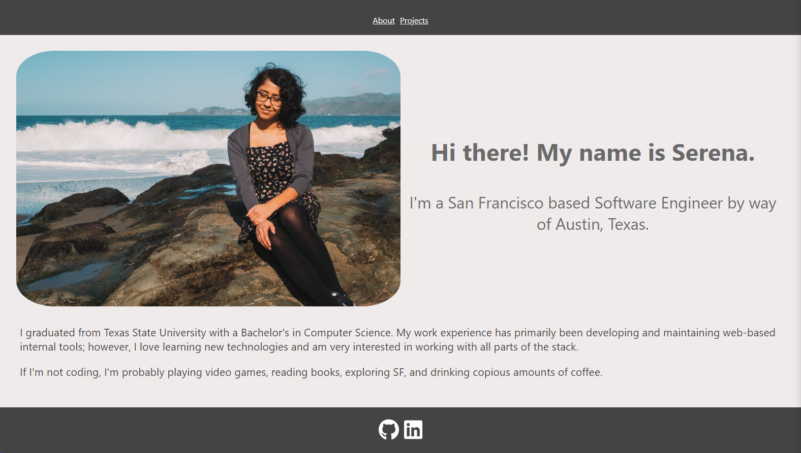
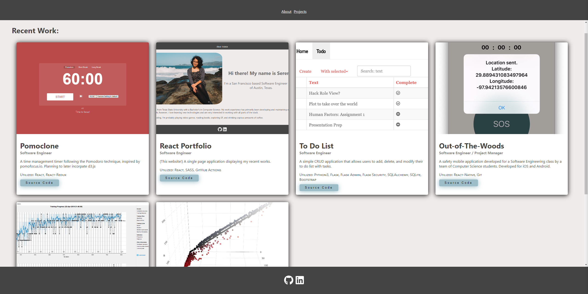

# Portfolio

Hi! I'm Serena. I'm a software engineer based out of San Francisco, CA. 🤠

Find more at [serenagutierrez.com](http://serenagutierrez.com/)

The portfolio dynamically populates the project content by pulling structured data from a JSON file to display multiple projects as card components. Created using React and SASS. 

This project is hosted via GitHub Pages, integrated with Cloudflare, and deployed through GitHub Actions. 
## Screenshots

Home: Two column design, a quick intro and projects

About: Longer bio

GitHub Actions Deployment Workflow

 This website has gone through some redesigns, if you're curious about how it used to look, toggle me!

About Page

Projects Page

